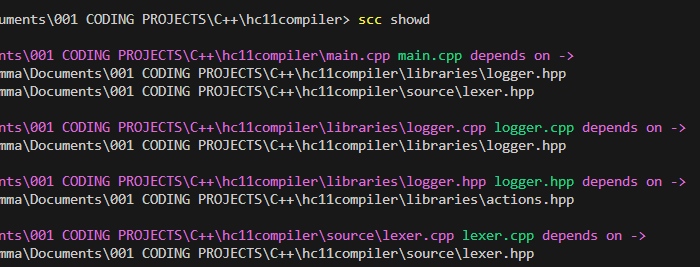

# Simple C++ Compiler

This is basically an auto compiling tool for c++. Currently only tested on Windows.

### Requirements
* Have the g++ compiler installed and set up in your PATH environment variable.

### Notice

This is still a very primitive tool. It doesn't allow for any customization of the compilation step. For example, adding extra flags to the g++ command has not been implemented.

## How to Use

Ensure header files have the extension of `.hpp` and source files have the extension of `.cpp`. All personal includes should use quotation marks while c++ library includes should use less than and greater than symbols.

Very simple. Download this project. Create an executable with dotnet or however you like. Add a path to your PATH environment variable where your resulting `scc.exe` executable resides.

After installation. Simply open up a cmd window and execute the command `scc your_main_cpp_file.cpp`. And that's it, the compiler should be smart enough to do all of the dependency linking for you.

Some file strutures are not supported. One of these known ones is a one to many model. That is, when one header file is depended on by multiple source files.

### Extra Command Options

* `scc clean` will clean the exectuable file and all of the object files out of your directory.

* `scc showd` will show a list of header and source files along with their dependencies.



### Pre Compile File Headers

```c++
turns off compiler warnings for that file
// SCC<nowarn>
```